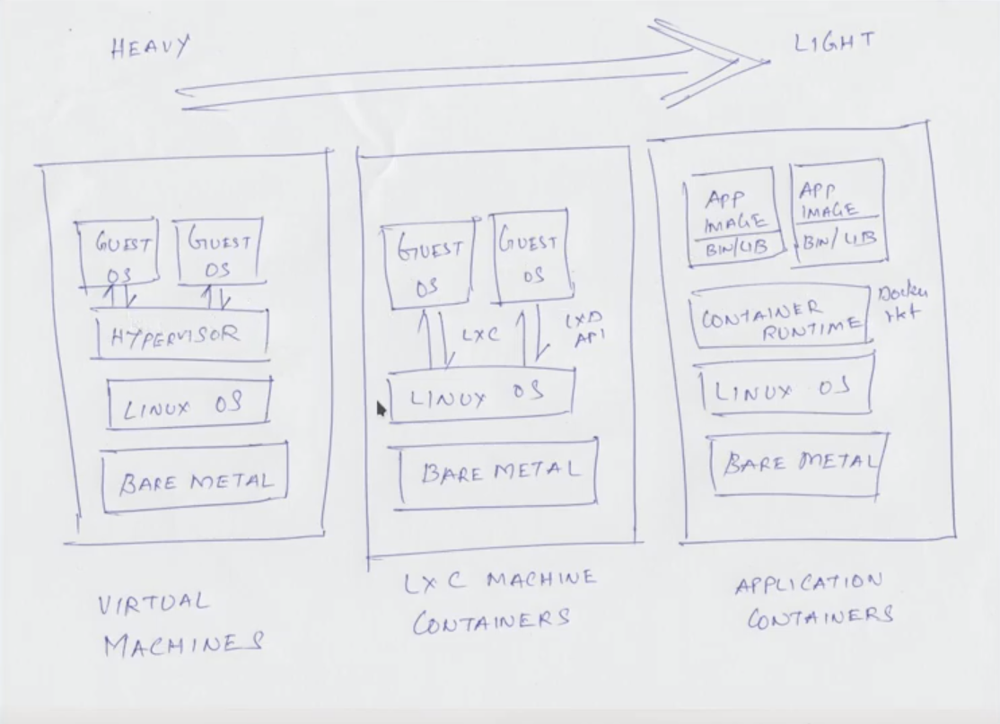
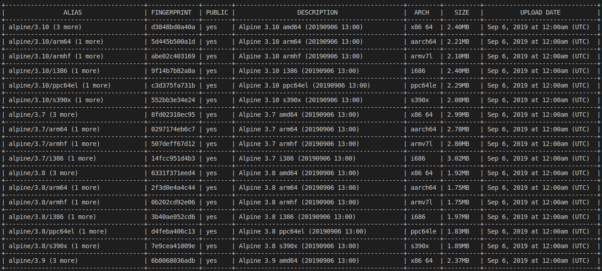

# LXC Containers



## Iniciamos el demonio lxd
Después de la instalación, lxd no se inicia, podemos comprobarlo con:
```
$ sudo systemctl status lxd
```
Para iniciarlo ejecutamos
```
$ sudo systemctl start lxd
```
## Permisos a usuario para ejecución de comandos lxc
Hay un grupo de usuarios denominado `lxd` (podemos verificarlo con `getent group lxd`). Si queremos lanzar comandos `lxc` sin el prefijo `sudo`, tenemos que añadir nuestro usuario (vagrant) al grupo `lxc`.
```
$ sudo gpasswd -a vagrant lxd
Adding user vagrant to group lxd
$ getent group lxd
lxd:x:108:ubuntu,vagrant
```
Para que los cambio surtan efecto, hay que hacer logout y login.

## Inicialización del entorno lxd
Ya tenemos el servidor iniciado, ahora necistamos iniciar el entorno lxd.
```
$ xld init
```
Todas las opciones las dejamos por defecto excepto el `storage backend` que lo cambiamos a `dir`:
```
Would you like to use LXD clustering? (yes/no) [default=no]: 
Do you want to configure a new storage pool? (yes/no) [default=yes]: 
Name of the new storage pool [default=default]: 
Name of the storage backend to use (btrfs, dir, lvm) [default=btrfs]: dir
Would you like to connect to a MAAS server? (yes/no) [default=no]: 
Would you like to create a new local network bridge? (yes/no) [default=yes]: 
What should the new bridge be called? [default=lxdbr0]: 
What IPv4 address should be used? (CIDR subnet notation, “auto” or “none”) [default=auto]: 
What IPv6 address should be used? (CIDR subnet notation, “auto” or “none”) [default=auto]: 
Would you like LXD to be available over the network? (yes/no) [default=no]: 
Would you like stale cached images to be updated automatically? (yes/no) [default=yes] 
Would you like a YAML "lxd init" preseed to be printed? (yes/no) [default=no]:
```
Comprobamos ahora que el servidor está en ejecución:
```
$ lxc version
To start your first container, try: lxc launch ubuntu:18.04

Client version: 3.0.3
Server version: 3.0.3
```

## Comandos útiles de xlc
### lxc storage list
Obtenemos una lista con el filesystem que va a utilizar para almacenar todas las imágenes de las máquinas.
```
$ lxc storage list
+---------+-------------+--------+------------------------------------+---------+
|  NAME   | DESCRIPTION | DRIVER |               SOURCE               | USED BY |
+---------+-------------+--------+------------------------------------+---------+
| default |             | dir    | /var/lib/lxd/storage-pools/default | 1       |
+---------+-------------+--------+------------------------------------+---------+
```

### lxc remote list
Obtendremos una lista de los servidores/repositorios desde los que podremos descargar las imágenes para nuestras máquinas.
```
$ lxc remote list
+-----------------+------------------------------------------+---------------+-----------+--------+--------+
|      NAME       |                   URL                    |   PROTOCOL    | AUTH TYPE | PUBLIC | STATIC |
+-----------------+------------------------------------------+---------------+-----------+--------+--------+
| images          | https://images.linuxcontainers.org       | simplestreams |           | YES    | NO     |
+-----------------+------------------------------------------+---------------+-----------+--------+--------+
| local (default) | unix://                                  | lxd           | tls       | NO     | YES    |
+-----------------+------------------------------------------+---------------+-----------+--------+--------+
| ubuntu          | https://cloud-images.ubuntu.com/releases | simplestreams |           | YES    | YES    |
+-----------------+------------------------------------------+---------------+-----------+--------+--------+
| ubuntu-daily    | https://cloud-images.ubuntu.com/daily    | simplestreams |           | YES    | YES    |
+-----------------+------------------------------------------+---------------+-----------+--------+--------+
```

### lxc image list
Muestra las imágenes en la máquina local.
```
$ lxc image list
+-------+-------------+--------+-------------+------+------+-------------+
| ALIAS | FINGERPRINT | PUBLIC | DESCRIPTION | ARCH | SIZE | UPLOAD DATE |
+-------+-------------+--------+-------------+------+------+-------------+
```
En nuestro caso, no tenemos ninguna por ahora.

### lxc image list images:
En este caso, estamos obteniendo las imágenes de uno de los repositorios de imágenes que tenemos disponibles, en este caso, estamos preguntando por las imágenes disponibles en el repositorio de nombre **images**.

Si buscamos una imagen en particular, tendremos que escribir algo como
```
$ lxc image list images:ubuntu
...
$ lxc image list images:centos
...
```

### lxc launch
*Para imágenes ubuntu no es necesario indicar el nombre del repositorio, para el resto sí.*
```
$ lxc launch ubuntu:16.04
Creating the container
Container name is: neutral-fish             
Starting neutral-fish
```
Obtenemos un nombre aleatorio para la imagen. Podemos consultar la lista de imágenes disponibles en local con el comando:
```
$ lxc list
+--------------+---------+----------------------+----------------------------------------------+------------+-----------+
|     NAME     |  STATE  |         IPV4         |                     IPV6                     |    TYPE    | SNAPSHOTS |
+--------------+---------+----------------------+----------------------------------------------+------------+-----------+
| neutral-fish | RUNNING | 10.21.211.232 (eth0) | fd42:b135:84b:b646:216:3eff:fe6c:e0be (eth0) | PERSISTENT | 0         |
+--------------+---------+----------------------+----------------------------------------------+------------+-----------+
```
Sobre la dirección ip asginada. Si ahora ejecutamos:
```
$ ip a s
1: lo: <LOOPBACK,UP,LOWER_UP> mtu 65536 qdisc noqueue state UNKNOWN group default qlen 1000
    link/loopback 00:00:00:00:00:00 brd 00:00:00:00:00:00
    inet 127.0.0.1/8 scope host lo
       valid_lft forever preferred_lft forever
    inet6 ::1/128 scope host 
       valid_lft forever preferred_lft forever
2: enp0s3: <BROADCAST,MULTICAST,UP,LOWER_UP> mtu 1500 qdisc fq_codel state UP group default qlen 1000
    link/ether 02:76:54:76:58:75 brd ff:ff:ff:ff:ff:ff
    inet 10.0.2.15/24 brd 10.0.2.255 scope global dynamic enp0s3
       valid_lft 83443sec preferred_lft 83443sec
    inet6 fe80::76:54ff:fe76:5875/64 scope link 
       valid_lft forever preferred_lft forever
3: lxdbr0: <BROADCAST,MULTICAST,UP,LOWER_UP> mtu 1500 qdisc noqueue state UP group default qlen 1000
    link/ether fe:11:88:81:91:4f brd ff:ff:ff:ff:ff:ff
    inet 10.21.211.1/24 scope global lxdbr0
       valid_lft forever preferred_lft forever
    inet6 fd42:b135:84b:b646::1/64 scope global 
       valid_lft forever preferred_lft forever
    inet6 fe80::f8c9:ceff:fe11:9e42/64 scope link 
       valid_lft forever preferred_lft forever
5: vethXVUQPB@if4: <BROADCAST,MULTICAST,UP,LOWER_UP> mtu 1500 qdisc noqueue master lxdbr0 state UP group default qlen 1000
    link/ether fe:11:88:81:91:4f brd ff:ff:ff:ff:ff:ff link-netnsid 0
    inet6 fe80::fc11:88ff:fe81:914f/64 scope link 
       valid_lft forever preferred_lft forever
```
Veremos la subred **lxdbr0** con el rango de direcciones IP que tendrán nuestras instancias y la interfaz virtual de red asociada a la nueva instancia creada, en este caso **vethXVUQPB@if4**.

### xlc stop & start
```
$ lxc stop neutral-fish
$ lxc list
+--------------+---------+------+------+------------+-----------+
|     NAME     |  STATE  | IPV4 | IPV6 |    TYPE    | SNAPSHOTS |
+--------------+---------+------+------+------------+-----------+
| neutral-fish | STOPPED |      |      | PERSISTENT | 0         |
+--------------+---------+------+------+------------+-----------+
```
```
$ lxc start neutral-fish
$ lxc list
+--------------+---------+----------------------+----------------------------------------------+------------+-----------+
|     NAME     |  STATE  |         IPV4         |                     IPV6                     |    TYPE    | SNAPSHOTS |
+--------------+---------+----------------------+----------------------------------------------+------------+-----------+
| neutral-fish | RUNNING | 10.21.211.232 (eth0) | fd42:b135:84b:b646:216:3eff:fe6c:e0be (eth0) | PERSISTENT | 0         |
+--------------+---------+----------------------+----------------------------------------------+------------+-----------+
```

### xlc delete
Antes de borrar tenemos que detener.
```
$ lxc stop neutral-fish
$ lxc delete neutral-fish
$ lxc list
+------+-------+------+------+------+-----------+
| NAME | STATE | IPV4 | IPV6 | TYPE | SNAPSHOTS |
+------+-------+------+------+------+-----------+
```

### xlc copy
Es posible copiar instancias
```
$ lxc copy myinstance1 myinstance2
```
El estado de la nueva instancia será **STOPPED**.

### xlc info
```
$ lxc info myubuntu1
Name: myubuntu1
Remote: unix://
Architecture: x86_64
Created: 2019/09/07 09:02 UTC
Status: Running
Type: persistent
Profiles: default
Pid: 5521
Ips:
  eth0: inet    10.21.211.147   vethM6C40S
  eth0: inet6   fd42:b135:84b:b646:216:3eff:fe3e:b577   vethM6C40S
  eth0: inet6   fe80::216:3eff:fe3e:b577        vethM6C40S
  lo:   inet    127.0.0.1
  lo:   inet6   ::1
Resources:
  Processes: 23
  CPU usage:
    CPU usage (in seconds): 5
  Memory usage:
    Memory (current): 72.94MB
    Memory (peak): 284.10MB
  Network usage:
    eth0:
      Bytes received: 498.95kB
      Bytes sent: 8.25kB
      Packets received: 155
      Packets sent: 97
    lo:
      Bytes received: 0B
      Bytes sent: 0B
      Packets received: 0
      Packets sent: 0
```

### xlc config show
```
$ lxc config show myubuntu1
architecture: x86_64
config:
  image.architecture: amd64
  image.description: ubuntu 16.04 LTS amd64 (release) (20190814)
  image.label: release
  image.os: ubuntu
  image.release: xenial
  image.serial: "20190814"
  image.version: "16.04"
  volatile.base_image: 69ccc7f2e0ff3e2a7b9056fb4d2300aaa5cd5ee9c1a6c9c31eb68f325fb84ab1
  volatile.eth0.hwaddr: 00:16:3e:3e:b5:77
  volatile.idmap.base: "0"
  volatile.idmap.next: '[{"Isuid":true,"Isgid":false,"Hostid":100000,"Nsid":0,"Maprange":65536},{"Isuid":false,"Isgid":true,"Hostid":100000,"Nsid":0,"Maprange":65536}]'
  volatile.last_state.idmap: '[{"Isuid":true,"Isgid":false,"Hostid":100000,"Nsid":0,"Maprange":65536},{"Isuid":false,"Isgid":true,"Hostid":100000,"Nsid":0,"Maprange":65536}]'
  volatile.last_state.power: RUNNING
devices: {}
ephemeral: false
profiles:
- default
stateful: false
description: ""
```

### xlc profile list
Muestra una lista de los profiles disponibles.
```
$ lxc profile list
+---------+---------+
|  NAME   | USED BY |
+---------+---------+
| default | 2       |
+---------+---------+
```
#### ¿Qué hay dentro de un profile?
Información relacionada con el *storage pool*, el *network bridge*, ...
```
$ lxc profile show default
config: {}
description: Default LXD profile
devices:
  eth0:
    name: eth0
    nictype: bridged
    parent: lxdbr0
    type: nic
  root:
    path: /
    pool: default
    type: disk
name: default
used_by:
- /1.0/containers/myubuntu1
- /1.0/containers/myubuntu2
```

Es posible crear nuevos profiles y crear nuevas instancias con esos nuevos profiles. Es posible establecer en los profiles los límites de memoria, de CPU, etc.

Aunque estos límites también se pueden aplicar directamente.

#### Crear un nuevo profile
```
$ lxc profile copy default custom
$ lxc profile list
+---------+---------+
|  NAME   | USED BY |
+---------+---------+
| custom  | 0       |
+---------+---------+
| default | 2       |
+---------+---------+
```
Ahora podemos editar el profile custom y establecer los límites de memoria y de CPU.
```
$ export EDITOR=vim
$ lxc profile edit custom
```
Podemos cambiar
```
config: {}
```
por
```
config:
  limits.memory: 512MB
  limits.cpu: 1
```

#### Crear nueva máquina virtual con un profile determinado
```
$ lxc launch ubuntu:16.04 myubuntu3 --profile custom
```

### xlc file
Para mover ficheros entre el host anfitrión y los containers.

#### Copiar un fichero local a un container
Es ligeramente distinto de scp, no es necesario el carácter ':'.
```
$ lxc file push myfile myubuntu1/root/
```

#### Copiar un fichero de un container a local
```
$ lxc file pull myfile myubuntu1/root/myfile .
```

## Login en instancias
```
$ lxc exec myubuntu1 bash
root@myubuntu1:~#
```
Accederemos con usuario **root**. Para acceder con otro usuario, por ejemplo, **ubuntu**, ejecutamos:
```
$ lxc exec myubuntu2 su - ubuntu
To run a command as administrator (user "root"), use "sudo <command>".
See "man sudo_root" for details.

ubuntu@myubuntu2:~$
```

## Comunicación entre containers
Podemos hacer ping usando el nombre DNS con el dominio **.lxd**.
```
# ping myubuntu2.lxd
PING myubuntu2.lxd (10.21.211.193) 56(84) bytes of data.
64 bytes from myubuntu2.lxd (10.21.211.193): icmp_seq=1 ttl=64 time=0.122 ms
64 bytes from myubuntu2.lxd (10.21.211.193): icmp_seq=2 ttl=64 time=0.103 ms
64 bytes from myubuntu2.lxd (10.21.211.193): icmp_seq=3 ttl=64 time=0.099 ms
64 bytes from myubuntu2.lxd (10.21.211.193): icmp_seq=4 ttl=64 time=0.097 ms
^C
--- myubuntu2.lxd ping statistics ---
4 packets transmitted, 4 received, 0% packet loss, time 3058ms
rtt min/avg/max/mdev = 0.097/0.105/0.122/0.012 ms
```

# Setup K8s con contenedores lxc

## Creación de profile para K8s
Creamos un nuevo profile para K8s e incluimos las siguientes líneas bajo config:
```
  limits.cpu: "2"
  limits.memory: 2GB
  limits.memory.swap: "false"
  linux.kernel_modules: ip_tables,ip6_tables,netlink_diag,nf_nat,overlay
  raw.lxc: "lxc.apparmor.profile=unconfined\nlxc.cap.drop= \nlxc.cgroup.devices.allow=a\nlxc.mount.auto=proc:rw
    sys:rw"
  security.privileged: "true"
  security.nesting: "true"
```
Los contenedores linux lxc que vamos a crear como kmaster y kworker, deberán poder crear otros contenedores en su interior. Es por esto que creamos un nuevo profile con ciertos privilegios.

## Creación del kmaster y los kworkers
```
$ lxc launch images:centos/7 kmaster --profile k8s
$ lxc launch images:centos/7 kworker1 --profile k8s
$ lxc launch images:centos/7 kworker2 --profile k8s
$ lxc launch images:centos/7 kworker3 --profile k8s
```